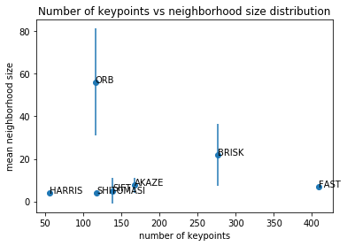
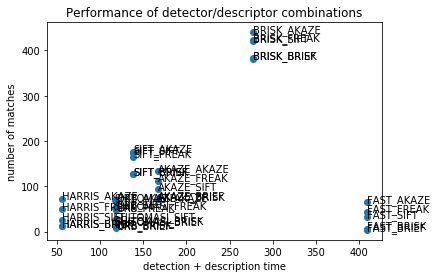

# Writeup of feature tracking project

# MP1
Implemented in `dataStructures.h` as a template `LeakyStack<T>` wrapping 
`deque<T>`.
#MP2
Implemented in `matching2D_Student.cpp`. Harris could be done by just passing 
a boolean into `cv::goodFeaturesToTrack`, the others mostly by calling 
`cv::Feature2D::create()` and `detect()`.

# MP3
Lines 121-130 of `matching2D_Student.cpp`, using `cv::Rect::contains()`

# MP4
Implemented in `descKeypoints` function as specified. The only noteworthy bits are:
firstly, had to set `class_id=0` in each keypoint for AKAZE to work; secondly,
when I use ORB for descriptors, it reliably causes an out of memory error (issue raised at
https://knowledge.udacity.com/questions/71544), so I left ORB descriptors out of the 
comparison pending technical mentor answer.

#MP5, MP6
Implemented in `matchDescriptors` function. Had to be careful about treating 
binary vs float-valued descriptors differently

# MP7
Here the distribution of the number of points vs neighborhood size distribution -
raw data in detector_stats.csv

Here I would say that I like BRISK's spread over multiple scales, but also reaching down into the smaller scales; as well
as the large number of keypoints it detects. The only one I don't like here is ORB that only seems to choose very large 
regions - that makes me worry it won't be very good at matching.

#MP8
The raw data is in matcher_stats.csv, the summary in the figure here:

Not surprisingly, total calculation time is dominated by keypoint detection time; descriptior calculation
is negligible in comparison.

Which ones are the best? Clearly lower calculation time is better; I would say that more matches is also 
better as I'd think it makes subsequent processing more robust. Given that, the 3 combinations that dominate
the others are HARRIS_AKAZE, SIFT_AKAZE, and BRISK_AKAZE, where each is a bit slower than the previous one, 
but generates more matches. In choosing between them, I'd go for SIFT_AKAZE first as offering a tradeoff
between speed and number of keypoints, then BRISK_AKAZE because of the nice multiscale behavior of BRISK noted
earlier, and finally for HARRIS_AKAZE.

Ultimately the application would determine the right tradeoff between speed and number of keypoints.

The code used to generate the pictures is in `notebooks/Keypoint_stats.ipynb`
